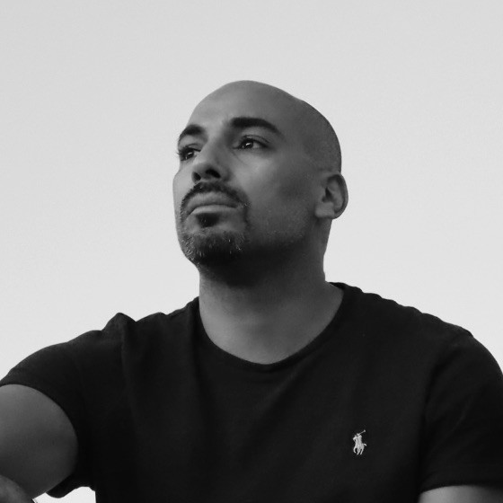
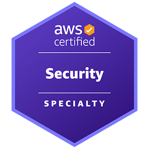
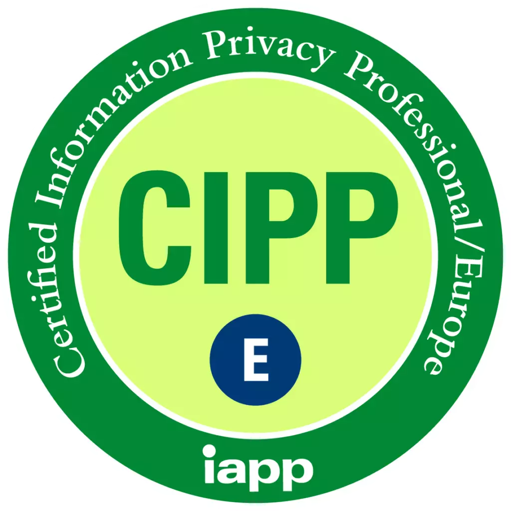

# About Me

Farid is a dedicated information security professional with over five years of experience in both the public and private sectors. He has held various roles, including Security Engineer, Security Manager, Security Instructor, Penetration Tester, and Incident Responder.

He is experienced in helping organizations improve their security posture and achieve internationally recognized standards such as ISO27001 and SOC2.

Farid holds several recognized certifications, including Offensive Security Certified Professional OSCP, AWS Security Specialty, and Certified Information Privacy Professional/Europe CIPP/E.

Currently based in Dallas, Texas.

  